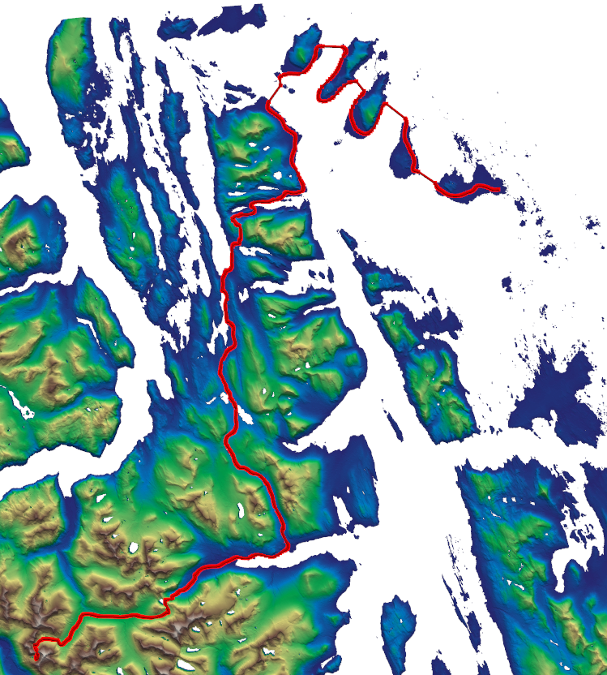

# Programming-project: Mountain Path Finder



This is a personal programming project that loads geographical elevation data (.tif files) and calculates an optimal hiking path through mountainous terrain. 

I started this project because I wanted to learn how to work with geographical data in Python and apply some pathfinding ideas (like A* search) to real-world maps. I also wanted to find a good path for a hike in Norway, which is where the idea originally came from.

---

The code runs a pipeline to turn raw geographic data into a 3D path:

1. **Loading Terrain (STAC & COGs)**: The script queries the Microsoft Planetary Computer STAC catalog for Copernicus DEM (`cop-dem-glo-30`) tiles covering the selected bounding box. Instead of downloading full tiles, it streams data on-demand over HTTP from Cloud Optimized GeoTIFFs (COGs), merging and loading only the relevant pixels.
2. **Water & Ocean Masking**: The pipeline queries the JRC Global Surface Water (GSW) dataset to identify inland lakes and rivers, and automatically classifies any terrain pixel at or below sea level ($elevation \le 0.0\text{m}$) as water to capture oceans and fjords.
3. **Quadtree Decomposition**: To avoid running pathfinding on millions of pixels, the terrain is split recursively into regions. Regions with high elevation variance are split into smaller quadrants, while flat areas are left as larger squares. This places more nodes in complex terrain and fewer in flat areas.
4. **Poisson Disk Sampling & Water Filtering**: Points are sampled inside each quadtree region. The radius is smaller in deep quadtree levels (rough terrain) and larger in shallow levels. Any sample points falling on water are discarded so that graph nodes are only created on land.
5. **Delaunay Triangulation**: The sampled points are connected to their nearest neighbors using Delaunay triangulation to form a clean network of edges.
6. **Graph and A* Search**: A graph is built using NetworKit. Edge weights are calculated based on 3D distance and slope (steep slopes are penalized quadratically). If an edge crosses a water body, a quadratic water crossing penalty proportional to the crossing distance ($\text{water\_penalty} \times \text{dist\_3d}^2$) is added to discourage swimming and encourage narrow stream crossings.
7. **Path Smoothing**: Raw paths on a node network tend to have jagged corners. The code uses a parametric cubic spline to smooth out these sharp turns.

---

## Project Structure

* **`main.py`**: The main script that runs the entire pipeline from loading the data to calculating the path and showing the 3D plot.
* **`Notebook/optimal_mountain_path.ipynb`**: A notebook explaining the process, the math, and the logic behind the steps.
* **`src/config.py`**: Holds all the variables and parameters (like max quadtree depth, slope penalty alpha, and sampling radius).
* **`src/`**: Modular python files containing the code for loading, quadtree creation, sampling, graph creation, and point selection.

---

## Installation & Setup

You will need Python 3.10 or newer.

1. Clone the project:
   ```bash
   git clone <repo-url>
   cd noorwegen_project
   ```

2. Create a virtual environment and activate it:
   ```bash
   python -m venv venv
   source venv/bin/activate
   ```

3. Install the required libraries:
   ```bash
   pip install -r requirements.txt
   ```

---

## How to Run

To run the pipeline:

```bash
python main.py
```

When you run `main.py`:
1. An interactive Tkinter map window will open. You can pan/zoom to find your area of interest.
2. Click the **Confirm & Export Bounding Box** button at the bottom of the map.
3. The script will automatically query the STAC API, download and merge all intersecting Copernicus DEM tiles covering your bounding box, and prompt you to click a start and end point in the 2D window to compute the optimal 3D path.

---

## Capabilities & Limitations

### Capabilities
* **On-Demand DEM Streaming**: Queries the STAC API dynamically to fetch and merge Copernicus elevation tiles on the fly over HTTP (no need to manually download or store gigabytes of regional raster files).
* **Adaptive Density (Quadtree)**: Varies graph node density dynamically based on terrain roughness (more nodes in steep valleys/cliffs for fine-grained planning, fewer nodes in flat areas to optimize memory and speed).
* **Physics-Based Weighting**: 
  * **Quadratic Slope Penalty**: Discourages scaling steep cliffs, pushing the pathfinder to seek gentler, winding routes.
  * **Quadratic Water Crossing Penalty**: Scales quadratically with the width of the crossing, preventing the pathfinder from "swimming" across wide fjords or lakes, while naturally allowing crossings at narrow channels.
* **GPU-Accelerated 3D Visuals**: Generates clean, interactive 3D mesh surface renderings (using PyVista/VTK) and automatically thresholds out ocean/water cells to prevent distorted cliff-edge artifacts.

### Limitations
* **Area Constraints**: Bounding box selections are capped (default $10,000\text{ km}^2$) to prevent planetary STAC timeouts and memory exhaustion.
* **Network Connectivity**: Requires an active internet connection to query the STAC API and stream tiles.
* **Discrete Edge Constraints**: The pathfinder is constrained to the Delaunay triangulation network of sampled points; it cannot plan paths *between* the network edges (though spline smoothing helps mitigate this).
* **Binary Water Assumption**: Water bodies are treated as binary obstacles (either land or water) based on elevation $\le 0$ and the GSW mask; the model does not account for currents, depths, or tides. I might look into this in the future, though. 

